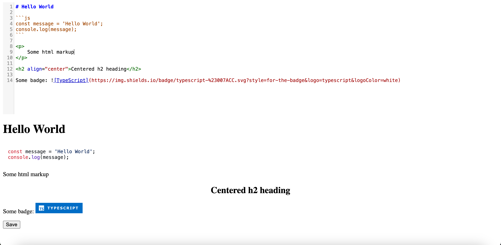

# Collaborative Markdown Editor Example



<div align="center">
  
  
  
  
  
  
</div>

<p align="center" style="width: 90%; margin: 0 auto">
Collaborative Markdown Editor built on modern and simple web technologies with markdown editing libraries integrations, which allows a few users create and edit markdowns in real time through specific `documentId` sharable link and changes can be saved in <b>database</b> Can serve as a boilerplate for building your amazing app 😊.
</p>

## 📦 Installation
- Make sure you have `Docker` installed on your machine
- And run
```bash
docker compose up
```
_Note: On older versions of `Docker` through dash_
```bash
docker-compose up
```

## 💡 Contributions

Contributions are welcome! You can help make this example better in several ways:

- **Bug Fixes**: If you find any bugs, feel free to open an issue or submit a pull request to fix them.
- **Feature Requests**: Have an idea for a new feature or improvement? Share it by opening an issue.
- **Documentation**: Help improve the project's documentation to make it clearer and easier to understand.
- **Testing**: Write additional tests to ensure the reliability of the code.
- **Code Quality**: Review existing code and suggest improvements to make it more readable and maintainable.

Your contributions will make this example more user-friendly, reliable, and bug-free. Every contribution, big or small, is appreciated and will be acknowledged in the project's documentation. Read more in [CONTRIBUTION.md](./CONTRIBUTION.md).
